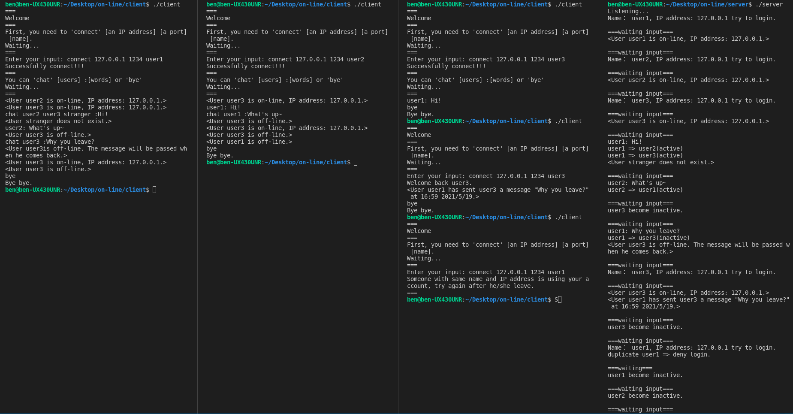

# Online chatting service
## How to run
- `make`
- `./client`
- `./user`
- `make clean`
## Support 5 commands
- Client
    - `connect IP_address port_number name`
    - `chat receiver1 [receiver2...] :message`
    - `bye`
    - `help`
- Server
    - `crtl+c` to terminate the server
## Fuction
- Support multiple users
- Send message to offline users
- Block duplicate user
    - (but same user with different IP address is different)
- Identify when user send message to none exist user
## Idea
- client
    - establish the connection
    - create two threads
        - one for send data
        - one for receive data
- server
    - loop for accept connection
    - when accept success, create a thread th handle that client
## Demo

